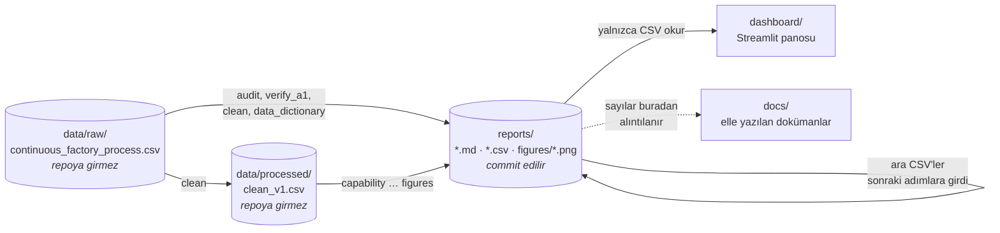
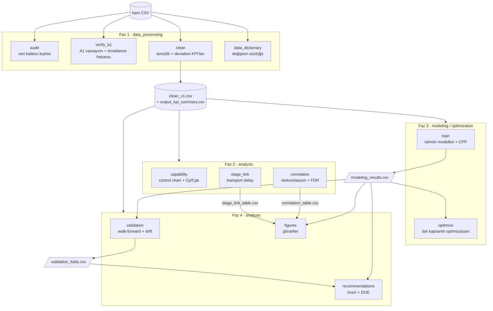
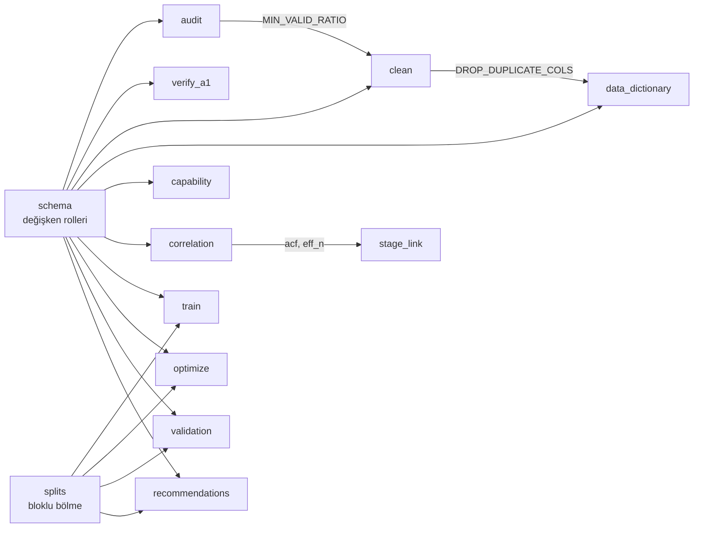
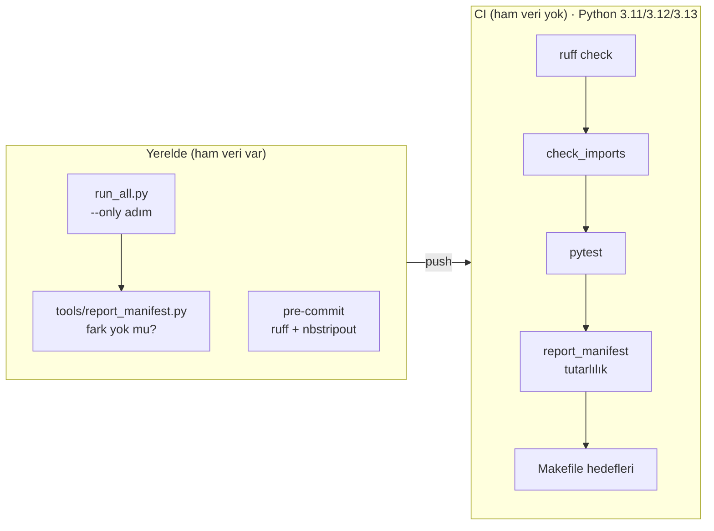

# Mimari

Pipeline'ın hangi adımının neyi okuyup neyi yazdığı, modüllerin birbirine nasıl
bağlı olduğu ve bu zincirin nerede doğrulandığı.

> **Konum notu:** Bu dosya elle yazılıyor, `docs/` altında durmasının nedeni bu.
> Bir adımın girdisi ya da çıktısı değişirse burası da güncellenmeli. Tablolar
> `src/` içindeki `read_csv` / `to_csv` / `write_text` çağrılarından çıkarıldı.

---

## 1. Veri katmanları



Üç kural bu ayrımdan çıkıyor:

- **`reports/` altındaki her şey script çıktısıdır.** `run_all.py` onu silip
  yeniden üretebilir; elle düzenlenen bir rapor bir sonraki çalıştırmada kaybolur
  ve CI'daki manifest kontrolünde kırmızıya döner.
- **Ham veri ve `clean_v1.csv` repoda yok.** Kaggle lisansı dağıtıma izin
  vermiyor (bkz. README, Lisans). Bu yüzden CI pipeline'ı çalıştıramaz; yalnızca
  commit edilmiş raporların tutarlılığını doğrular.
- **Pano hiçbir sayıyı yeniden hesaplamaz.** `reports/` altındaki CSV'leri okur,
  bu yüzden depoyu klonlayan herkeste ham veri olmadan da çalışır.

## 2. Pipeline akışı

`run_all.py` 12 adımı aşağıdaki sırayla çalıştırır. Her adım ayrı bir süreçte
(`subprocess`) çalışır; adımlar arasındaki tek bağ diske yazılan dosyalardır.



Kritik düğümler `clean` ve `train`. `clean`'in iki çıktısını 5–12 arası her
adım okur (şemada faz kutusuna tek ok; hangi adımın hangisini okuduğu aşağıdaki
tabloda). `modeling_results.csv` dört adımın girdisi. `run_all.py --only`
seçilen adımları her zaman pipeline sırasına dizer; bunun nedeni bu
bağımlılıklar.

### Adım adım girdi ve çıktılar

| # | Adım | Okur | Yazar |
|---|---|---|---|
| 1 | `audit` | ham CSV | `01_data_quality_report.md`, `output_quality_table.csv`, `variable_schema.csv` |
| 2 | `verify_a1` | ham CSV | `a1_verification.md`, `a1_verification.csv` |
| 3 | `clean` | ham CSV | `data/processed/clean_v1.csv`, `02_cleaning_report.md`, `output_kpi_summary.csv` |
| 4 | `data_dictionary` | ham CSV | `data_dictionary.md`, `data_dictionary.csv` |
| 5 | `capability` | `clean_v1`, `output_kpi_summary` | `03_capability_report.md`, `capability_table.csv` |
| 6 | `correlation` | `clean_v1`, `output_kpi_summary` | `04_correlation_report.md`, `correlation_table.csv` |
| 7 | `stage_link` | `clean_v1`, `output_kpi_summary` | `05_stage_link_report.md`, `stage_link_table.csv` |
| 8 | `train` | `clean_v1`, `output_kpi_summary` | `06_modeling_report.md`, `modeling_results.csv`, `feature_importance.csv` |
| 9 | `optimize` | `clean_v1`, `modeling_results` | `07_optimization_report.md`, `optimization_points.csv` |
| 10 | `validation` | `clean_v1`, `modeling_results` | `08_validation_report.md`, `validation_folds.csv` |
| 11 | `recommendations` | `clean_v1`, `output_kpi_summary`, `modeling_results`, `validation_folds` | `09_recommendations.md`, `effect_sizes.csv` |
| 12 | `figures` | `clean_v1`, `output_kpi_summary`, `correlation_table`, `stage_link_table`, `modeling_results` | `figures/01…05_*.png` |

Yollar `reports/` altındadır, aksi yazılmadıkça. İlk dört adım yalnızca ham
veriyi okur, birbirine dosya üzerinden bağlı değildir.

## 3. Modül bağımlılıkları

Adımlar dosya üzerinden konuşur; bazı modüller ise birbirinden **sabit ya da
fonksiyon** import eder. `src/` bir paket değil: her script, ihtiyaç duyduğu alt
dizini `sys.path`'e ekleyip `import schema` biçiminde çağırır (gerekçe:
`tests/conftest.py`).



- **`schema`** hangi kolonun karar değişkeni, hangisinin gürültü ya da çıktı
  olduğunu belirler (varsayım A1). Neredeyse her adım ona bağlı; kuralı
  değişirse bütün pipeline yeniden çalıştırılmalı.
- **`splits`** zaman serisinde sızıntısız bölme ve embargo hesabını tutar.
  Modelleme ile doğrulama aynı bölme mantığını kullansın diye tek yerde.
- **Sabit paylaşımı bilinçli:** `MIN_VALID_RATIO` yalnızca `audit.py`'de,
  `DROP_DUPLICATE_COLS` yalnızca `clean.py`'de tanımlı. İki yerde yazılsaydı
  audit'in "modellenemez" listesi ile temizliğin kapsam kuralı sessizce
  ayrışabilirdi.
- `figures.py` hiçbir proje modülünü import etmez; yalnızca CSV okur.

Bir dosya taşınınca bu import zinciri yalnızca o script çalıştırılınca kırılır.
`tools/check_imports.py` bütün modülleri import ederek bunu CI'da yakalar.

## 4. Doğrulama katmanları



| Katman | Neyi yakalar | Nerede |
|---|---|---|
| `pytest` | Temizlik kuralları, Cp/Cpk, FDR, bloklu bölmede sızıntı, optimizasyon kısıtları, pano veri katmanı | yerel + CI |
| `check_imports.py` | Taşınan/yeniden adlandırılan modülün kırdığı import zinciri | CI |
| `report_manifest.py` | Kod değişikliğinin raporu sessizce kaydırması (yerel); elle düzenlenmiş ya da manifesti güncellenmemiş rapor (CI) | yerel + CI |
| `ruff` | E, F, W, I kuralları (gerekçeler `ruff.toml` içinde) | pre-commit + CI |
| `test_notebooks.py` + nbstripout | Hücre çıktısı taşıyan defterin commit edilmesi | pre-commit + CI |

Testler ham veriye dokunmaz. Gerçek veriyle yeniden üretim kontrolü yalnızca
yerelde yapılabilir:

```bash
python run_all.py --only <adım>
python tools/report_manifest.py   # "tamam" demeli; fark bilinçliyse --update
```

Manifest `reports/*.md` ve `reports/*.csv`'yi kapsar; PNG'ler hariç, çünkü
baytları matplotlib/freetype sürümüne bağlı.
